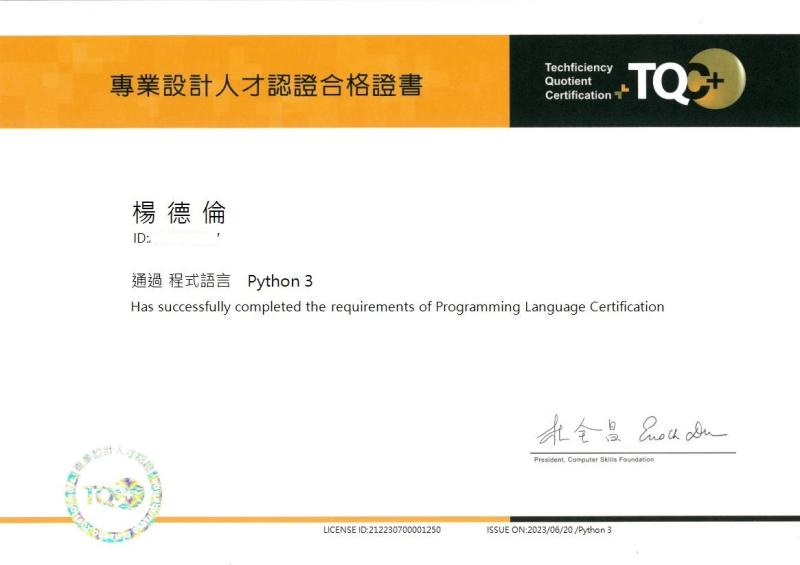

# TQC-Python
程式語言
- 每一題皆經過 Code Judger 平台測試：「答案正確」。
- 若內容用在考試時出現問題，請與我回報: darren@darreninfo.cc
  - 非上課學員請勿來信，我不會回。
  - 請提供姓名、上課地點或班號，以及考試題號、地點、日期。

## 網頁連結
- [程式語言 Python 3](https://www.tqcplus.org.tw/CertificateDetail.aspx?CODE=y/zEfkGeQhM=)
- [Code Judger](https://www.codejudger.com/)

## 認證方式
- 本認證為操作題，總分為100分。
- 操作題為第一至九類各考一題共九大題，除第四題20分外，其餘每題10分，總計100分。
- 於認證時間100分鐘內作答完畢，成績加總達70分（含）以上者該科合格。

## 題庫類別
- TQC+ 程式語言Python 第1類：**基本程式設計**
  - 變數與常數、指定敘述、標準輸入輸出、運算式、算術運算子、數學函式的應用、格式化的輸出
- TQC+ 程式語言Python 第2類：**選擇敘述**
  - if、if...else、if…elif
- TQC+ 程式語言Python 第3類：**迴圈敘述**
  - while、for…in
- TQC+ 程式語言Python 第4類：**進階控制流程**
  - 常用的控制結構、條件判斷、迴圈
- TQC+ 程式語言Python 第5類：**函式(Function)**
  - 函式使用、傳遞參數、回傳資料、內建函式、區域變數與全域變數
- TQC+ 程式語言Python 第6類：**串列(List)的運作(一維、二維以及多維)**
  - 串列的建立、串列的函式、串列參數傳遞、串列應用
- TQC+ 程式語言Python 第7類：**數組（Tuple）、集合（Set）以及詞典（Dictionary）**
  - 數組、集合、詞典的建立、運作及應用
- TQC+ 程式語言Python 第8類：**字串(String)的運作**
  - 字串的建立、字串的庫存函式、字串的應用
- TQC+ 程式語言Python 第9類：**檔案與異常處理**
  - 文字I/O、檔案的建立、寫入資料與讀取資料、二進位I/O、編碼（Encoding）、異常處理
  
## 證照樣式
